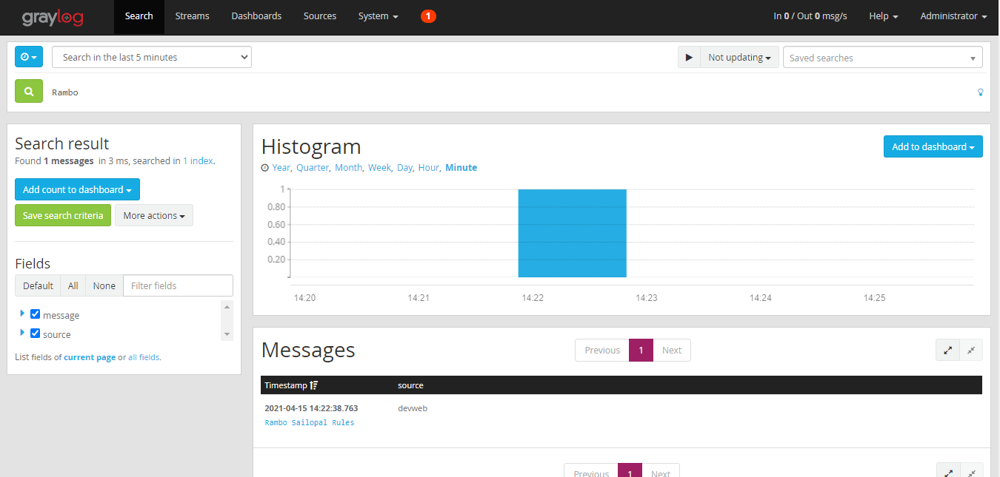

# graylog-messages

<b>Background</b>

Two command line utility to send messages to a Graylog server. One utility sends messages messages by message and the other process a file

<b>Prerequisites</b>

A working deployment of Graylog Server with a GELF HTTP input running pn a given port

<b>Single message send</b>

Parameters - 

                 First parameter - The Address of the graylog server
                 Second parameter - The port of the GRaylog server
                 Third Paramter - The message to send
                 
Usage Example - 

                 graysingle "graylog-server" "12202" "Ramb0 Sailopal Rules"
                 
The message will then show in Graylog as shown in the above picture

 
                 

